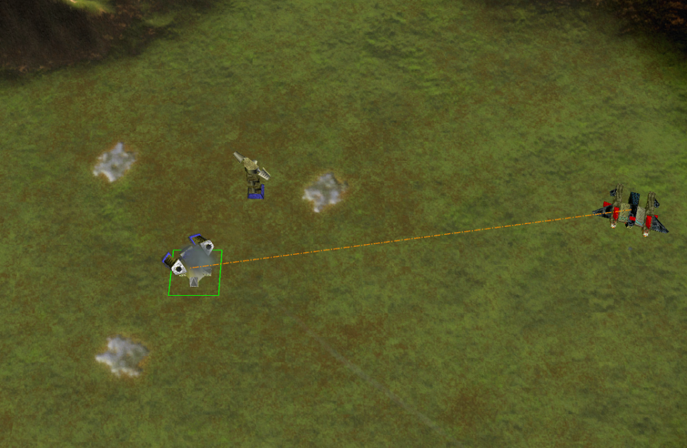
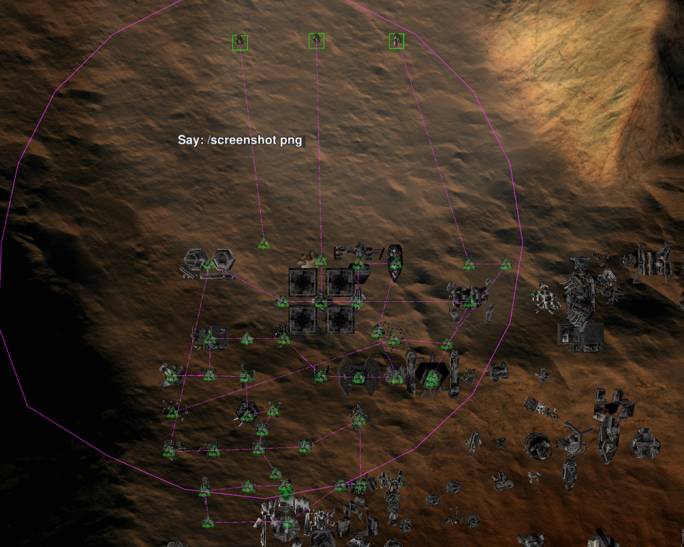

# 5 widgets for springrts (2 of these 5 have different versions. 7 widgets in total)

Original game : https://fr.wikipedia.org/wiki/Total_Annihilation

1 engine, multiples mods.

| Spring RTS Engine : https://springrts.com/                   |  |
| ------------------------------------------------------------ | :----------------------------------------------------------- |
| Mod looking like total annihilation https://balancedannihilation.com/ |  |
| Another mod https://www.beyondallreason.info/                |                                                              |
|                                                              |                                                              |

## cmd_middle_mouse_button.lua:

### Purpose

This widget should avoid camera blocked with only few capacity to move when middle mouse button is clicked with overhead camera mode or fps camera mode or rot overhead camera mode, and if middle mouse button is not holded. But by enabling this widget, it should disable for you the possibility, at least in overhead camera mode, to navigate on map by holding middle mouse button.
(This behaviour of "blocked camera" could occur with overhead camera mode or fps camera mode or rot overhead camera mode, and if middle mouse button is not holded.)

#### Widget link : https://github.com/flower-spring/scripts_for_springrts/blob/master/cmd_middle_mouse_button.lua

&nbsp;  

## cmd_selfd_mines_for_some_units.lua:
### Purpose

For months, or rather years I saw some mines sometimes did not explode with BA 9* (or 11). This widget should resolve this.

This widget give a self-d command for the mines when an enemy is near a mine, except if enemy speed > 120, (for example the jeffys, fleas or planes have speed > 120) or except if enemy speed <120 and the mine has a wait command.

The mine should still explode if :
-an enemy is just upon the mine, the mine uncloak and the enemy fire on the mine. 
-an enemy is really near the mine, the mine uncloak and the enemy fire on the mine.
-something fire on the mine whether the mine was uncloaked or not
(If an enemy has an hold fire command and this enemy is just above an allie uncloaked mine, and nothing fire on the mine, the mine should not explode)

Widget not really needed to fix mines for BA 10.24 or BA test (BA test = beyond all reason mod) cause it seemed the mines were already fixed for ba10.24 and byar. And I didn't saw an option to put mines on wait for BA 10.24 (while it was possible for ba 9* or 11), so this widget should not completely work for BA 10.24. 

Widget tested for a few weeks. No bug found.

(A link to springrts forum topic about mines bug : https://springrts.com/phpbb/viewtopic.php?f=44&t=41088&p=593857#p593857 )

(I tested impact of this widget for fps and didn't saw significative impact. According to widget profiler widget, percent was about 0 for total percentage of running time spent in luaui callins, and about 1kB/s for 300 armmine3 total rate of mem allocation by luaui callins. Defense range was something like 300kB/s at start.)

#### Link of this mines widget : https://github.com/flower-spring/scripts_for_springrts/blob/master/cmd_auto_selfd_the_mines.lua

--- another version added 5 october 2020 : crawling mines included

#### Link : https://github.com/flower-spring/scripts_for_springrts/blob/master/cmd_auto_selfd_the_mines_and_crawling_mines.lua

&nbsp;  

## cmd_set_specific_targets_for_mercuries_and_screamers.lua:

### Purpose:

Auto set target for mercuries and screamers to certains planes hierarchically (to better avoid a liche attack for example).
By order mercuries/screamers units should auto aim :

1. liches/krows
2. bombers/seabombers, torpedo bombers  
3. radars t2 planes  
4. brawlers  
5. construction aircraft  

#### First version link : https://github.com/flower-spring/scripts_for_springrts/blob/master/cmd_set_specific_targets_for_mercuries_and_screamers.lua

New version v3 4 oct 2020: if stockpile == 5/5, screamer and/or mercury is (are) on "fire at will". Widget impact screamer/mercury only if projectile stockpile of the screamer/mercury is < 5.

#### Version v3 : https://github.com/flower-spring/scripts_for_springrts/blob/master/cmd_set_specific_targets_for_mercuries_and_screamers_v3.lua

&nbsp;

## unit_smart_area_reclaim+.lua:
### Purpose

Extra ability to suck only metal wrecks not resurrectable if you start drag above a non resurrectable wreck.
And only resurrectable wrecks if you start reclaim above a resurrectable wreck.

&nbsp;

On the illustration image above you could see 3 rezzers with 3 differents orders :
From the left to the right :
- one rezzer with a reclaim command started above the ground.
- one rezzer with a reclaim command started above a resurrectable unit.
- one rezzer with a reclaim command started above a not resurrectable unit.

#### Link : https://github.com/flower-spring/scripts_for_springrts/blob/master/unit_smart_area_reclaim%2B.lua

&nbsp;

## cmd_ctrl-x_select_all_units_visibles_of_previous_selection.lua:
### Purpose

For bind ctrl+x : select same units visbles of previous selected units. Wrote for a player.

#### Link : https://github.com/flower-spring/scripts_for_springrts/blob/master/cmd_ctrl-x_select_all_units_visibles_of_previous_selection.lua

&nbsp;  

# Installation of these widgets on a standard computer
## Installation under windows
If you are under windows, you should put them in C:\Users\your_current_account_name\Documents\My Games\Spring\LuaUI\Widgets
## Installation under linux
If you are under linux, I'm unsure, but I think you should put downloaded widget(s) in ~./spring/LuaUI/Widgets

## Verification of the installation
You should see the widgets ingame in the list after pressed the F11 key.
New widget(s) should appear(s) after the widgets wrote with an asterisk at the end.
